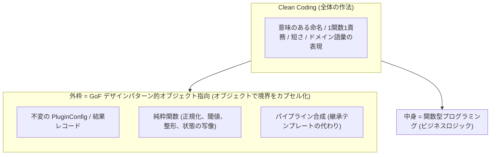
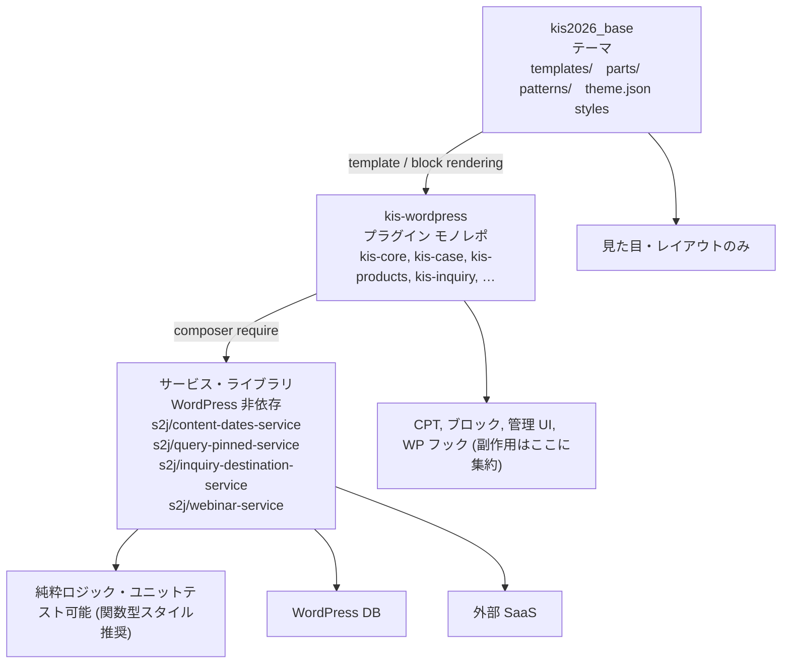

# KIS WordPress - エコシステム仕様 (FOP + Clean Coding)

本ドキュメントでは、WordPress プラグイン「KIS WordPress」の専用仕様を定義します。

共通基盤は、引き続き次に準拠します。

* [WP_PLUGIN_SPEC.md (共通仕様)](https://github.com/stein2nd/wp-plugin-spec/blob/main/WP_PLUGIN_SPEC.md)

採用・合意前の設計メモとして `docs_mod/` に置き、確定後は `docs/` 配下に分割・移行します。

## 設計・実装の基本アプローチ

本プラグインは、次を **基本アプローチ** とします。

* **FOP (Functional Object-Oriented Programming) + Clean Coding 土台**  
* Clean Architecture はフル採用せず、**借用する原則だけ** を取り入れる

### 組み合わせの理由

WordPress プラグインでは、貢献者が追いやすい **FOP 寄り** を主とし、Clean Architecture の儀式的レイヤ分けは避けます。

| 手法 | 活かす利点 | 抑えたい欠点 |
| --- | --- | --- |
| Clean Coding | 読みやすさ、命名、短い関数 | 原則の盲信による過剰分割 |
| GoF デザインパターン | 外枠の再利用、意思疎通 | クラス爆発、過剰設計 |
| 関数型プログラミング | 不変データ、純粋な計算の予測しやすさ | 学習コスト、I/O / 状態の扱いにくさ |

### 役割分担 (実装時の約束)

1. Clean Coding を全体の基礎に敷く
   * GoF デザインパターン / 関数型プログラミングのどちらを使う箇所でも、読みやすさを最優先する。
   * 抽象やパターンは「読む人のコスト」を下げない範囲でのみ使う。
2. システムの外枠を GoF デザインパターン (オブジェクト指向) に担当させる
   * 依存の接続、外部 API、WP hooks / REST / DOM / Gutenberg store など **副作用と境界** をオブジェクト (または明確なアダプタモジュール) で包む。
   * 振る舞いに関するパターン (Strategy / Command 等) は、**クラス階層ではなく、高階関数・クロージャ** で足りるなら後者を選ぶ (GoF デザインパターンの堅牢性 + 関数型プログラミングの簡素さ)。
3. データの中身を関数型プログラミングに担当させる
   * **ビジネスロジック** は、純粋関数と不変データに閉じる。


```mermaid
flowchart TD
    subgraph CleanCoding ["Clean Coding (全体の作法)"]
        direction TB
        c1["意味のある命名 / 1関数1責務 / 短さ / ドメイン語彙の表現"]
    end

    subgraph OuterFrame ["外枠 = GoF デザインパターン的オブジェクト指向 (オブジェクトで境界をカプセル化)"]
        direction TB
        r1["Adapter (翻訳 API / 類似度 / WP Option / エディター)"]
        r2["薄い Facade (REST、設定画面の入口)"]
        r3["必要最小の DI (依存をコンストラクタ or 引数で渡す)"]
    end

    subgraph InnerContents ["中身 = 関数型プログラミング (ビジネスロジック)"]
        direction TB
        r1["不変の PluginConfig / 結果レコード"]
        r2["純粋関数 (正規化、閾値、整形、状態の写像)"]
        r3["パイプライン合成 (継承テンプレートの代わり)"]
    end

    CleanCoding --> OuterFrame
    CleanCoding --> InnerContents
```

### Clean Architecture から借用する原則

フルセットの Clean Architecture (Entity / UseCase / Gateway / Presenter の定型分割) は採用しません。Clean Architecture から、次だけを借用します。

| 借用する原則 | 本プラグインでの意味 |
| --- | --- |
| 依存の向きは外 → 内 | ドメイン純関数は、WordPress / HTTP を知らない |
| 内側はビジネスルール | 正規化、閾値、パイプライン組立は、フレームワーク非依存 |
| 外側は詳細 | REST、設定画面、外部 API クライアントは、置換可能な境界 |

「内側を不変・外側をオブジェクト指向」という現代的解釈の精神は、FOP と一致します。フォルダー劇場や層の儀式は作りません。

## ドキュメント索引

| 文書 | 内容 |
| --- | --- |
| [関連リポジトリ](#関連リポジトリ) | 本モノレポ / 別 repo / 既存 S2J の地図 |
| [プラグイン一覧と責務](#プラグイン一覧と責務) | CPT、データモデル、Phase |
| [横断機能 (S2J プロダクト)](#横断機能-s2j-プロダクト) | 更新日、ピン優先 Query、SaaS 送信 |
| [フェーズロードマップ](#フェーズロードマップ) | Phase-0〜5と repo split |

## 関連リポジトリ

本 repo は [kis-wordpress](https://github.com/stein2nd/kis-wordpress.git)。テーマは [kis2026_base](https://github.com/stein2nd/kis2026_base.git) (見た目、FSE)。テーマ側 [§1.5 依存プラグイン](https://github.com/stein2nd/kis2026_base/blob/main/docs/spec.md) は索引で、詳細の正は本書。実装はロードマップ順であり、8本を今すぐ実装する前提ではない。

### 本モノレポが当面管理するプラグイン

Phase-0〜1 (必要なら Phase-2の kis-inquiry 完成まで) は `plugins/` に置く。データモデル等の詳細は [プラグイン一覧と責務](#プラグイン一覧と責務)。

| プラグイン | 担当 | Phase |
| --- | --- | --- |
| **kis-core** | 共通基盤 (CPT 移管、Template Debug) | 0 |
| **kis-inquiry** | 問い合わせ・資料請求 (Snow Monkey Forms、SaaS 送信) | 0〜2 |
| **kis-case** | 導入事例 | 1 |
| **kis-corporate** | 会社情報 | 1 |
| **kis-recruit** | 採用情報 | 1 |
| **kis-products** | 製品情報 (`product` + `product_section`) | 1 |
| **kis-reason** | KIS が選ばれる理由 | 1 |
| **kis-news** | ニュース・お知らせ (`post` または専用 CPT) | 0〜1 |

### 別リポジトリ (汎用・サービス)

横断機能の Composer ライブラリは **S2J プロダクトとして別 repo** に切り出しました。仕様の正は各 repo の `docs_mod/service_spec.md` です。次は各サービスの仕様確定と実装、その後に呼び出し側プラグインの仕様です。`s2j-site-policy-manager` は最初から別 repo です。製品方針は当該 repo の `docs_mod/product-direction.md` を参照します。詳細は [横断機能 (S2J プロダクト)](#横断機能-s2j-プロダクト)。

| 名称 | 種別 | リポジトリ | 備考 | 状態 |
| --- | --- | --- | --- | --- |
| **S2J Site Policy Manager** | WP プラグイン | [s2j-site-policy-manager](https://github.com/stein2nd/s2j-site-policy-manager.git) | ポリシー台帳。KIS は個人情報の保護方針と情報セキュリティ基本方針。旧称 S2J Legal | 方向性メモ |
| **S2J Content Dates** | WP プラグイン | [s2j-content-dates](https://github.com/stein2nd/s2j-content-dates.git) | 公開日と更新日の表示。仕様は [specs.md](https://github.com/stein2nd/s2j-content-dates/blob/main/docs_mod/specs.md) | 仕様ドラフト |
| **S2J Content Dates Service** | Composer サービス | [s2j-content-dates-service](https://github.com/stein2nd/s2j-content-dates-service.git) | 公開日・更新日の算出 (WP 非依存)。仕様は [service_spec.md](https://github.com/stein2nd/s2j-content-dates-service/blob/main/docs_mod/service_spec.md) | 仕様ドラフト |
| **S2J Query Pinned** | WP プラグイン | [s2j-query-pinned](https://github.com/stein2nd/s2j-query-pinned.git) | 一覧の先頭にピン留めを置く。仕様は [specs.md](https://github.com/stein2nd/s2j-query-pinned/blob/main/docs_mod/specs.md) | 仕様ドラフト |
| **S2J Query Pinned Service** | Composer サービス | [s2j-query-pinned-service](https://github.com/stein2nd/s2j-query-pinned-service.git) | ピン優先 + 残り N 件の組立 (WP 非依存)。仕様は [service_spec.md](https://github.com/stein2nd/s2j-query-pinned-service/blob/main/docs_mod/service_spec.md) | 仕様ドラフト |
| **S2J Inquiry Destination** | WP プラグイン | [s2j-inquiry-destination](https://github.com/stein2nd/s2j-inquiry-destination.git) | 問い合わせの送信先。フォームは Snow Monkey Forms。仕様は [specs.md](https://github.com/stein2nd/s2j-inquiry-destination/blob/main/docs_mod/specs.md) | 仕様ドラフト |
| **S2J Inquiry Destination Service** | Composer サービス | [s2j-inquiry-destination-service](https://github.com/stein2nd/s2j-inquiry-destination-service.git) | 問い合わせ送信先のコンセント変換 (WP 非依存)。仕様は [service_spec.md](https://github.com/stein2nd/s2j-inquiry-destination-service/blob/main/docs_mod/service_spec.md) | 仕様ドラフト |
| **S2J Video Publisher** | WP プラグイン | [s2j-video-publisher](https://github.com/stein2nd/s2j-video-publisher.git) | YouTube の限定公開の公開期間。仕様は [specs.md](https://github.com/stein2nd/s2j-video-publisher/blob/main/docs_mod/specs.md) | 仕様ドラフト |
| **S2J Video Publisher Service** | Composer サービス | [s2j-video-publisher-service](https://github.com/stein2nd/s2j-video-publisher-service.git) | 限定公開の公開期間のリクエスト組立 (WP 非依存)。仕様は [service_spec.md](https://github.com/stein2nd/s2j-video-publisher-service/blob/main/docs_mod/service_spec.md) | 仕様ドラフト |
| **S2J Webinar** | WP プラグイン | [s2j-webinar](https://github.com/stein2nd/s2j-webinar.git) | [GatherPress](https://github.com/GatherPress/gatherpress) のコンパニオン。イベント UI は [フォーク版 GatherPress](https://github.com/stein2nd/gatherpress)。仕様は [specs.md](https://github.com/stein2nd/s2j-webinar/blob/main/docs_mod/specs.md) | 仕様ドラフト |
| **S2J Webinar Service** | Composer サービス | [s2j-webinar-service](https://github.com/stein2nd/s2j-webinar-service.git) | Zoom Webinar のリクエスト組立 (WP 非依存)。仕様は [service_spec.md](https://github.com/stein2nd/s2j-webinar-service/blob/main/docs_mod/service_spec.md) | 仕様ドラフト |

### 既存 S2J プラグイン (連携)

| プラグイン | 本モノレポでの用途 |
| --- | --- |
| [S2J Alliance Manager](https://github.com/stein2nd/s2j-alliance-manager.git) | トップ / reason のアイコンパレード (ブロック + ショートコード) |
| [S2J Slug Generater](https://github.com/stein2nd/s2j-slug-generater.git) | 新 CPT のスラッグ生成 ([S2J Similarity Service](https://github.com/stein2nd/s2j-similarity-service.git) 利用) |
| [kis-event-manager](https://github.com/yuki-530/kis-event-manager.git) | 現行イベント。段階的に GatherPress フォーク + S2J Webinar へ差し替え |

## 背景と目的

### 現状の課題

* コンテンツの多くが **テーマ (kis2026_base) と ACF / MW WP Form に強く依存** しており、テーマ差し替えで表示が壊れる。
* テーマはクラシック PHP 主体。`theme.json` は骨格のみで、`templates/` / `parts/` は未整備。
* フロントページ (`https://www.kisnet.co.jp/`) の生成テンプレートが分かりにくい (`index.php` 直書き、`front-page.php` なし)。
* MW WP Form は保守停止。問い合わせデータの WP DB 蓄積を避け、外部 SaaS 起票に移行したい。

### 目的

1. **テーマとデータの分離** — テーマは見た目、FSE テンプレートのみ。
2. **Full Site Editor 対応** — 固定ページ・パターン・ブロックで編集可能に。
3. **テーマ非依存** — プラグイン群で CPT、フォーム・表示ロジックを保持。
4. **リポジトリ分割を見据えた設計** — ドキュメント・コード境界を将来 repo に対応させる。

### 非目標 (Phase-0時点)

* 全ページの一括 CPT 化。
* ACF の即日・完全撤廃。
* SaaS 送信先の確定 (Backlog / Asana / Jooto 等は Phase-2以降で選定)。
* 本番 (kisnet.co.jp) への即時切り替え。

## アーキテクチャー概要


```mermaid
flowchart TB
    A1["kis2026_base<br />テーマ<br />templates/　parts/　patterns/　theme.json　styles"]
    A2["kis-wordpress<br />プラグイン モノレポ<br />kis-core, kis-case, kis-products, kis-inquiry, …"]
    A3["サービス・ライブラリ<br />WordPress 非依存<br />s2j/content-dates-service<br />s2j/query-pinned-service<br />s2j/inquiry-destination-service<br />s2j/webinar-service"]

    A1 --> B1["見た目・レイアウトのみ"]
    A1 -->|template / block rendering| A2

    A2 --> B2["CPT, ブロック, 管理 UI, WP フック (副作用はここに集約)"]
    A2 -->|composer require| A3

    A3 --> B3["純粋ロジック・ユニットテスト可能 (関数型スタイル推奨)"]
    A3 --> A4["WordPress DB"]
    A3 --> A5["外部 SaaS"]
```

### 既存製品との関係

連携する既存プラグインは、[既存 S2J プラグイン (連携)](#既存-s2j-プラグイン-連携) を参照。

## リポジトリ構成 (kis-WordPress モノレポ)

```text
kis-wordpress/
├── docs/                          # 確定後の正式仕様 (将来)
├┬─ docs_mod/                      # ドラフト・設計メモ (本ファイル含む)
│└── specs.md                   # ★ 仕様起点 (本書)
├┬─ plugins/                       # WordPress プラグイン
│├── kis-core/                  # Phase-0: 必須基盤
│├── kis-case/                  # Phase-1
│├── kis-corporate/             # Phase-1
│├── kis-recruit/             # Phase-1
│├── kis-products/            # Phase-1
│├── kis-reason/              # Phase-1
│└── kis-inquiry/             # Phase-0 骨格 → Phase-2 完成
├── composer.json                  # 開発ツール。プラグインは s2j/*-service を require
└── README.md
```

**ローカル配置 (開発):**

* `wp-content/plugins/kis-wordpress/`
    * 本 repo を clone
* `wp-content/themes/kis2026_base/`
    * テーマ (別 repo)

## プラグイン一覧と責務

| プラグイン | コンテンツ | データモデル | Phase |
| --- | --- | --- | --- |
| **kis-core** | 共通基盤 | — | 0 |
| **kis-news** (または core 内) | ニュース・お知らせ | `post` (ラベル変更) または `news` CPT | 0〜1 |
| **kis-case** | 導入事例 | CPT `case` + `case_cat`、ブロックエディター | 1 |
| **kis-corporate** | 会社情報 | 専用 CPT (年次更新あり) | 1 |
| **kis-recruit** | 採用情報 | 専用 CPT (年次更新あり) | 1 |
| **kis-products** | 製品情報 | CPT `product` + 子 `product_section` | 1 |
| **kis-reason** | KIS が選ばれる理由 | 専用 CPT または固定ページ + パターン | 1 |
| **kis-inquiry** | 問い合わせ・資料請求 | Snow Monkey Forms + SaaS | 0: 骨格 / 2: 完成 |
| **s2j-site-policy** (別 repo) | 個人情報・情報セキュリティ等 | ポリシー台帳 (固定ページに紐づけ) | 1〜 (別 repo) |

### イベント (モノレポ外)

* **kis-event-manager** は、段階的に次の組み合わせに置き換える。イベント UI は [GatherPress](https://github.com/GatherPress/gatherpress) のフォーク [stein2nd/gatherpress](https://github.com/stein2nd/gatherpress)。呼び出し側は [S2J Webinar](https://github.com/stein2nd/s2j-webinar.git)。Zoom のリクエスト組立は [S2J Webinar Service](https://github.com/stein2nd/s2j-webinar-service.git)。
* **kis-core** が `Kis_Event_Provider` インターフェースを提供し、一覧と単体の取得先を差し替える。Webinar の作成は、このインターフェースの外である。

```php
// イメージ (詳細は plugins/kis-core 仕様に)
interface Kis_Event_Provider {
    // イベント一覧取得・単体取得等
}
// 実装: Legacy_Kis_Event_Manager | GatherPress
```

### 製品情報 — 案 A (採用)

```text
product (親: Forwarder-PRO 等)
  └ product_section (子: 製品概要 / 主な機能 / Q&A …)
       slug: outline, function, qa 等 (compoPageNav アンカー連携)
```

### CPT にしないもの

更新頻度が低く **レイアウト編集が主目的** のコンテンツは、FSE の **固定ページ + ブロックパターン** も選択肢。  
ただし KIS サイトでは **テーマ非依存** のため、上表のとおり多くを専用プラグイン CPT で持つ方針。

## 横断機能 (S2J プロダクト)

日付・ピン留め・問い合わせ送信は kis-core に抱え込まず、**Composer ライブラリ + 呼び出し側 WP プラグイン** として切り出します。KIS サイトはそれらを require / 有効化します。

次の順で進めます。各サービスの仕様検討 → 実装 → 呼び出し側プラグインの仕様検討。

### 更新日の見える化 (created + modified)

**全プラグイン / s2j-site-policy / 将来の GatherPress イベントで利用しうる横断機能。**

仕様の正: [S2J Content Dates Service](https://github.com/stein2nd/s2j-content-dates-service/blob/main/docs_mod/service_spec.md)

| 要素 | 内容 |
| --- | --- |
| サービス | `s2j/content-dates-service` (WP 非依存の算出・判定) |
| 呼び出し側 | [S2J Content Dates](https://github.com/stein2nd/s2j-content-dates.git)。仕様は [specs.md](https://github.com/stein2nd/s2j-content-dates/blob/main/docs_mod/specs.md) |
| KIS での利用 | 固定記事 ・ CPT ・ 任意でメディア。製品親は子 `product_section` の `max(modified)` を集約 |

### Query Loop + ピン留め

仕様の正: [S2J Query Pinned Service](https://github.com/stein2nd/s2j-query-pinned-service/blob/main/docs_mod/service_spec.md)

| 要素 | 内容 |
| --- | --- |
| サービス | `s2j/query-pinned-service` (ピン優先の ID 列組立) |
| 呼び出し側 | [S2J Query Pinned](https://github.com/stein2nd/s2j-query-pinned.git)。仕様は [specs.md](https://github.com/stein2nd/s2j-query-pinned/blob/main/docs_mod/specs.md) |
| 合成 | 非ピンの更新日ソートは Content Dates。本サービスは日付を知らない |
| KIS での利用 | トップ / ニュース一覧など。任意で kis-news 用ラッパー |

### 問い合わせ / SaaS 送信

仕様の正: [S2J Inquiry Destination Service](https://github.com/stein2nd/s2j-inquiry-destination-service/blob/main/docs_mod/service_spec.md)

| 要素 | 内容 |
| --- | --- |
| フォーム | Snow Monkey Forms (MW WP Form は並行後廃止) |
| サービス | `s2j/inquiry-destination-service` (統一ペイロードと送信先ポート) |
| 呼び出し側 | [S2J Inquiry Destination](https://github.com/stein2nd/s2j-inquiry-destination.git)。仕様は [specs.md](https://github.com/stein2nd/s2j-inquiry-destination/blob/main/docs_mod/specs.md) |
| KIS | kis-inquiry はページと SMF。送信先ロジックは抱え込まない |
| Phase-2最初 | **メール送信のみ** から開始可 |

**アダプタ概念 (コンセント変換):**

```
[フォーム送信] → [統一ペイロード] → [設定で選択した送信先]
```

### テンプレートデバッグ (開発用)

| Phase | 内容 |
| --- | --- |
| 0 | kis-core: 管理バーに現在テンプレート表示 (`index.php` 等) |
| 3 | テーマ: `templates/front-page.html` を明示 |

Show Current Template プラグインへの依存は避ける。

## テーマ (kis2026_base) との境界

| テーマが持つ | プラグインが持つ |
| --- | --- |
| `theme.json`, SCSS/CSS | CPT / Taxonomy 登録 |
| `templates/`, `parts/`, `patterns/` | カスタムブロック |
| サイト全体の見た目 | ACF → ブロック / メタ |
| — | フォームフック、SaaS 連携 |
| — | ショートコード `[myinclude]` 等のブロック置換 |

### テーマから移管するもの (Phase-0優先)

`kis2026_base/functions.php` より:

* CPT `event`, `case` + Taxonomy `case_cat` の登録
* MW WP Form フック (`my_mwform_value`, `my_mwform_default_content`)
* ショートコード `[myinclude]`, `[templatedir]`, `[root]`
* 管理画面メニューラベル変更 (投稿 → ニュース・お知らせ)

### FSE ロードマップ (テーマ側)

| Phase | 内容 |
| --- | --- |
| 1 | `index.php` の Query 部分をピン優先ブロックに |
| 3 | `templates/front-page.html`, `parts/header.html`, `parts/footer.html` |
| 5 | PHP テンプレート削除 |

## ドキュメント分割方針 (repo split 容易化)

**原則:** 将来の repo が1本 = `docs/` サブツリーが1本。

```
docs/                              # 確定後
├── WP_KIS_ECOSYSTEM.md            # 全体索引 (本 specs.md の後継)
├── ARCHITECTURE.md                # モノレポ横断
├── plugins/
│   ├── kis-core/WP_PLUGIN_SPEC.md
│   ├── kis-case/WP_PLUGIN_SPEC.md
│   └── …
├── future-plugins/
│   └── s2j-site-policy-manager/WP_PLUGIN_SPEC.md    # → s2j-site-policy-manager repo にコピー
└── (日付・ピン・送信先の SERVICE_SPEC は各 s2j-*-service repo の docs/)
```

| 文書種別 | 準拠 |
| --- | --- |
| WP プラグイン | [wp-plugin-spec](https://github.com/stein2nd/wp-plugin-spec.git)|
| サービスライブラリ | `SERVICE_SPEC.md` (WP フック記載なし) |
| テーマ | kis2026_base `docs/` (THEME_SPEC 系) |

## コーディング方針

### wp-plugin-spec 準拠

* 全 WP プラグインは wp-plugin-spec に準拠。
* **副作用** (`add_action`, `register_post_type`) は bootstrap / hooks 層。
* **ロジック** はサービスライブラリまたは pure PHP 関数に。

### Composer

* モノレポ `composer.json`: 開発ツール (PHPUnit, PHPStan)。
* プラグイン個別 `composer.json`: `s2j/*-service` を require (パス仮置きは使わない)。
* サービスライブラリは **WordPress 非依存** (Similarity Service と同型)。

### URL

* 基本は現行 URL を踏襲 (`/products/forwarderpro/` 等)。
* 新規 CPT では **[S2J Slug Generater](https://github.com/stein2nd/s2j-slug-generater.git)** を利用可。

## フェーズロードマップ

* Phase-0
    * kis-WordPress モノレポ
    * ├ plugins/kis-core (CPT 移管、Template Debug)
    * ├ plugins/kis-inquiry (MW フック移管のみでも可)
    * ├3つの S2J サービス (仕様 → 実装) と、続く呼び出し側プラグイン仕様
    * └ docs_mod/specs.md → docs/ 分割開始
* Phase-1
    * kis-case / corporate / recruit / products / reason
* Phase-2
    * kis-inquiry 完成 (Snow Monkey Forms + メール → SaaS)
* Phase-3
    * テーマ FSE (front-page.html, parts/)
* Phase-4
    * ACF データ移行 → 脱 ACF (case 等)
* Phase-5
    * PHP テンプレート削除
    * (並行) S2J Site Policy Manager で `/privacy/` と `/informationsecurity/` を公開
    * (並行) GatherPress フォーク + S2J Webinar。Zoom 連携の計算は S2J Webinar Service

## 既知の移行課題

| 課題 | 対応 |
| --- | --- |
| ACF フィールド定義が DB のみ | Phase-1で `acf-json` エクスポート → 段階的ブロック化 |
| `inc/mw-wp-form-default-content.php` 欠落 | kis-inquiry で Snow Monkey Forms 用に再作成 |
| `index.php` トップ直書き | Phase-1〜3でブロック / front-page.html に |
| `wpautop` 無効化 | ブロック移行時に再検討 |
| `test01` 固定ページ HTML 差 (table ラッパー欠落等) | コンテンツ監査・修正 |
| テーマフォルダー名 `kis` vs `kis2026_base` | デプロイ手順書で明示 |

## 次のアクション (Phase-0)

1. [ ] `plugins/kis-core/` プラグイン骨格 (メインファイル・オートロード)
2. [ ] `event` / `case` CPT をテーマ `functions.php` から移管
3. [ ] 3つの S2J サービスの `service_spec.md` を進め、実装に移る
4. [x] 呼び出し側プラグインの仕様に着手 (Content Dates、Query Pinned、Inquiry Destination はドラフト済み)
5. [ ] 管理バー Template Debug
6. [ ] `docs/plugins/kis-core/WP_PLUGIN_SPEC.md` ドラフト
7. [ ] テーマ `functions.php` から移管済みコードを削除 (両 repo 同期後)

## 改訂履歴

| 日付 | 内容 |
| --- | --- |
| 2026-09-04 | 初版ドラフト (`docs_mod/specs.md` 起点作成) |
| 2026-09-28 | 関連リポジトリを本モノレポ / 別 repo / 既存 S2J の三段に再編 |
| 2026-09-29 | 日付・ピン・送信先を S2J サービスとして切り出し。呼び出し側プラグイン仕様は次工程 |
| 2026-09-29 | S2J Legal を S2J Site Policy Manager に改称。データモデルはポリシー台帳 |
| 2026-10-03 | 仮称 `s2j-◯◯◯◯` を、GatherPress フォーク + S2J Webinar (仮) + S2J Webinar Service に分割 |
| 2026-10-03 | S2J Webinar のリポジトリを [s2j-webinar](https://github.com/stein2nd/s2j-webinar) とし、仕様ドラフトを当該 repo に置いた |
| 2026-10-04 | S2J Video Publisher と S2J Video Publisher Service の仕様ドラフトを索引に加えた |
| 2026-10-04 | S2J Content Dates の仕様ドラフトを索引に加えた |
| 2026-10-04 | S2J Query Pinned の仕様ドラフトを索引に加えた |
| 2026-10-04 | S2J Inquiry Destination の仕様ドラフトを索引に加えた |

## 付録 A: コンテンツマップ (サイト IA)

| ラベル | URL (想定) | 担当 |
| --- | --- | --- |
| Site Top | `/` | テーマ + ピン優先ブロック等 |
| KIS が選ばれる理由 | `/reason/` | kis-reason |
| ニュース | `/news/` | kis-news / `post` |
| イベント | `/event/` | GatherPress フォーク + S2J Webinar |
| 製品情報 | `/products/` | kis-products |
| 導入事例 | `/case/` | kis-case |
| 会社情報 | `/corporate/` | kis-corporate |
| 採用情報 | `/recruit/` | kis-recruit |
| 問い合わせ | `/inquiry/` | kis-inquiry |
| 個人情報の保護方針 | `/privacy/` | s2j-site-policy |
| 情報セキュリティ基本方針 | `/informationsecurity/` | s2j-site-policy |

## 付録 B: 関連ドキュメント (未作成)

| パス | 状態 |
| --- | --- |
| `docs/WP_KIS_ECOSYSTEM.md` | 未作成 (本書の正式版) |
| `docs/ARCHITECTURE.md` | 未作成 |
| `docs/plugins/kis-core/WP_PLUGIN_SPEC.md` | 未作成 |
| 各 s2j-*-service `docs_mod/service_spec.md` | ドラフト着手 (本モノレポ外) |

確定後、本 `docs_mod/specs.md` の各節を上記に分割移行する。
